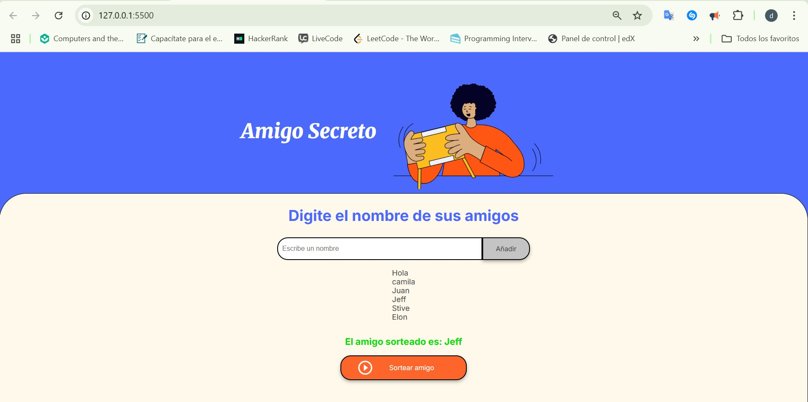

# 🎁 Challenge Amigo Secreto - Proyecto con JavaScript

Este es un proyecto básico desarrollado en HTML, CSS y JavaScript que permite a los usuarios agregar una lista de amigos y realizar un sorteo aleatorio para elegir al "amigo secreto".

## 📸 Vista del proyecto

## 🚀 Funcionalidades

- Agregar nombres a una lista de amigos.
- Validación para evitar campos vacíos.
- Visualización dinámica de los amigos agregados.
- Sorteo aleatorio para elegir un amigo secreto.
- Limpieza automática del campo de entrada.

## 🧠 Tecnologías usadas

- HTML5
- CSS3
- JavaScript 